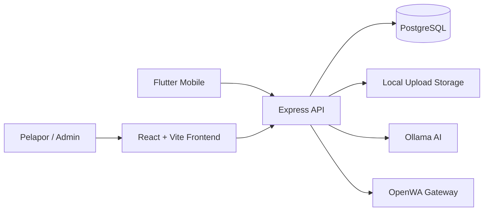

# Arsitektur OCC

## Gambaran Umum

## Komponen

### Frontend

- React 19 dan Vite.
- React Router untuk portal, login, dashboard, dan halaman administrasi.
- Axios client dengan `VITE_API_URL`.
- Tailwind CSS untuk tampilan.
- `ChatWidget` memanggil endpoint `/api/ai/chat`.

### Backend

- Node.js dengan Express dalam mode ES modules.
- `src/app.js` mendaftarkan middleware keamanan, upload statis, route, dan error handler.
- `src/server.js` membaca konfigurasi port dan memulai listener.
- Controller memuat logika pengaduan publik, dashboard, branding, dokumen, invoice, dan administrasi.
- JWT digunakan untuk autentikasi internal.

### Database

PostgreSQL menyimpan perusahaan, user, pengaduan, respons, attachment, SLA, dan audit log. Migration runner idempoten tersedia untuk instalasi dan update schema.

### Infrastruktur

Docker Compose menyediakan:

| Service | Container port | Host port |
|---|---:|---:|
| PostgreSQL | 5432 | 5433 |
| Backend | 5000 | 5000 |
| Frontend | 5173 | 5173 |
| Ollama | 11434 | 11435 |
| OpenWA | 2785 | 2785 |

Backend mengakses PostgreSQL, Ollama, dan OpenWA melalui nama service Docker dan port internal. Cloudflare Worker dapat digunakan sebagai proxy WhatsApp eksternal di luar stack lokal.

## Alur Pengaduan

1. Frontend mengirim multipart form ke `/api/public/complaints`.
2. Backend memvalidasi request, membuat tiket, dan menyimpan data ke PostgreSQL.
3. Attachment disimpan pada storage upload.
4. Pelapor menggunakan tiket dan email untuk memanggil endpoint tracking.
5. Admin memproses tiket melalui endpoint dashboard.

## Batas Arsitektur Saat Ini

- Beberapa query administrasi non-complaint masih membutuhkan audit scope company lanjutan.
- Static upload belum memiliki authorization per file.
- Notifikasi email belum memakai provider nyata.
- OpenWA membutuhkan QR pairing manual dan konfigurasi API key/send endpoint.
- Audit dan SLA sudah mencatat event utama, tetapi job breach otomatis belum ada.
- Tidak ada test suite backend/frontend yang mencerminkan alur bisnis utama.
